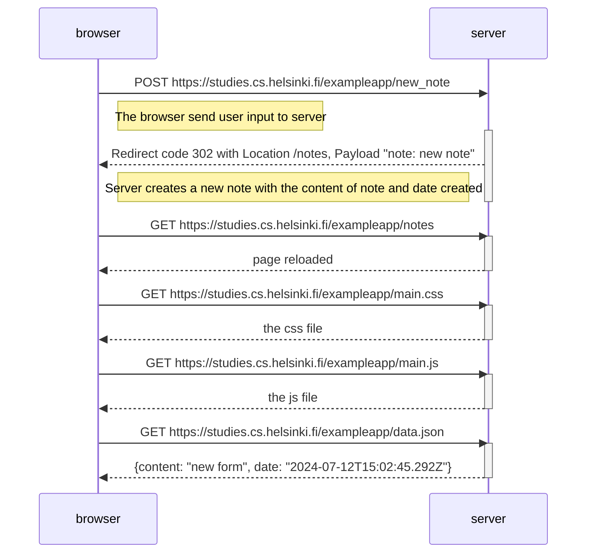

```mermaid

sequenceDiagram 

    participant browser
    participant server

    browser->>server: POST https://studies.cs.helsinki.fi/exampleapp/new_note
    Note right of browser: The browser send user input to server
    activate server
    server-->> browser: Redirect code 302 with Location /notes, Payload "note: new note"
    Note left of server: Server creates a new note with the content of note and date created
    deactivate server

    browser ->>server: GET https://studies.cs.helsinki.fi/exampleapp/notes
    activate server
    server -->> browser: page reloaded
    deactivate server

    browser->>server: GET https://studies.cs.helsinki.fi/exampleapp/main.css
    activate server
    server -->> browser: the css file
    deactivate server

    browser->>server: GET https://studies.cs.helsinki.fi/exampleapp/main.js
    activate server
    server -->> browser: the js file 
    deactivate server

    browser->>server: GET https://studies.cs.helsinki.fi/exampleapp/data.json
    activate server
    server -->> browser:  {content: "new form", date: "2024-07-12T15:02:45.292Z"}
    deactivate server
    
```
