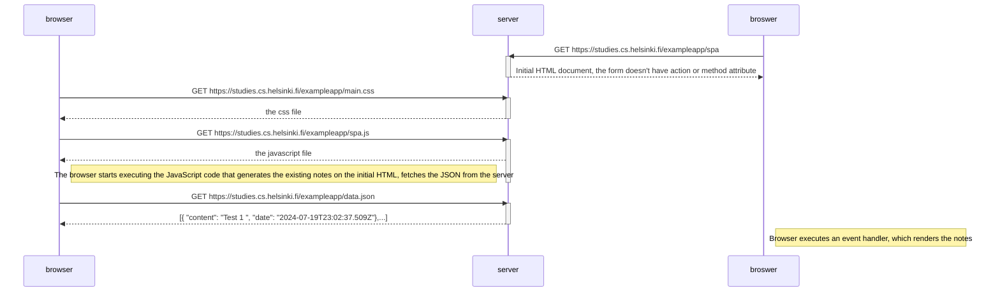

```mermaid

sequenceDiagram

    participant browser
    participant server 

    broswer->>server: GET https://studies.cs.helsinki.fi/exampleapp/spa
    activate server
    server-->>broswer: Initial HTML document, the form doesn't have action or method attribute
    deactivate server

    browser->>server: GET https://studies.cs.helsinki.fi/exampleapp/main.css
    activate server
    server-->>browser: the css file
    deactivate server 

    browser->>server: GET https://studies.cs.helsinki.fi/exampleapp/spa.js
    activate server
    server-->>browser: the javascript file
    Note right of browser: The browser starts executing the JavaScript code that generates the existing notes on the initial HTML, fetches the JSON from the server 
    deactivate server

    browser->>server: GET https://studies.cs.helsinki.fi/exampleapp/data.json
    activate server
    server-->>browser: [{ "content": "Test 1 ", "date": "2024-07-19T23:02:37.509Z"},...]
    deactivate server
    Note right of broswer: Browser executes an event handler, which renders the notes 
```

