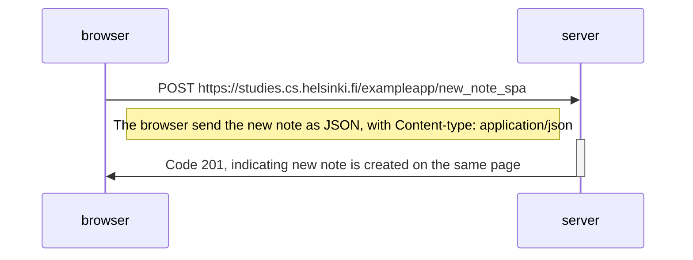

```mermaid

sequenceDiagram 
    participant browser
    participant server

    browser->>server: POST https://studies.cs.helsinki.fi/exampleapp/new_note_spa 
    Note right of browser: The browser send the new note as JSON, with Content-type: application/json
    activate server
    server->>browser: Code 201, indicating new note is created on the same page
    deactivate server

```